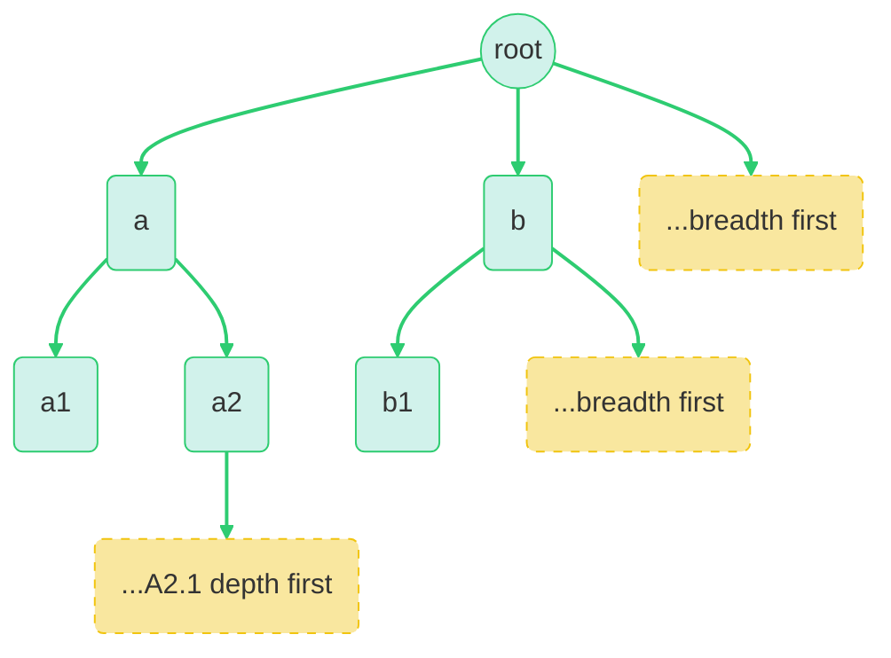

# Object Pagination



## Overview
This implementation provides a way to paginate through large JavaScript objects, supporting both breadth-first and depth-first traversal strategies. It's designed for dev-tools-like UIs where server-side objects need to be explored incrementally on the client.

## Key Features

- **Two Traversal Modes**
  - `wide` (Breadth-first): Explores objects level by level
  - `deep` (Depth-first): Follows each branch to its end before moving to siblings

- **Cursor-based Pagination**
  - Uses dot-notation paths as cursors (e.g., "a.b.0")
  - Resumes traversal from last viewed position
  - Default page size of 100 keys

- **Safety Features**
  - Handles circular references gracefully
  - Returns empty pages for invalid cursors
  - Supports nested arrays and objects

## Use Cases

```typescript
// Basic usage
const page = createPage2d({
  object: largeObject,
  direction: "wide",
  pageSize: 100
});

// Continue from previous position
const nextPage = createPage2d({
  object: largeObject,
  direction: "wide",
  cursor: "some.previous.path"
});
```

## Implementation Details

### Page Structure
- Uses a `Map` to maintain insertion order
- Tracks whether there are more items (`hasNextPage`)
- Provides the next cursor (`nextToken`)

### Traversal Strategies
1. **Breadth-First (`wide`)**
   - Explores all keys at current level before going deeper
   - Useful for getting a broad overview of object structure

2. **Depth-First (`deep`)**
   - Follows each path to its deepest point before moving laterally
   - Better for exploring specific branches thoroughly

## Considerations

### Performance
- Lazy evaluation: Only traverses until page is full
- Cursor-based resumption avoids re-traversing entire object

### Edge Cases
- Circular references
- Large arrays
- Deeply nested objects
- Invalid cursors

## Future Improvements

1. **UI Integration**
   - Implement expand/collapse UI controls
   - Add scroll-based pagination
   - Visual indicators for expandable nodes

2. **Performance**
   - Cache traversal results
   - Implement virtual scrolling
   - Optimize for very large arrays

3. **Features**
   - Search/filter capabilities
   - Custom key sorting
   - Value preview/truncation
