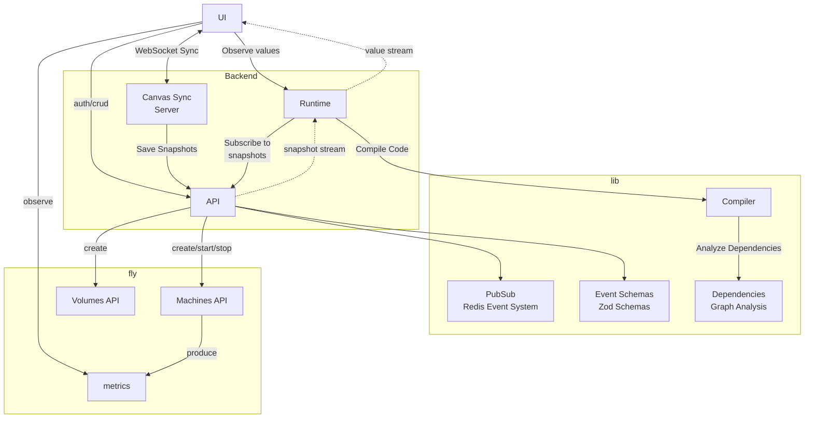

This system is an [infinite canvas](https://infinitecanvas.tools/) digital AI workbench built for technologists. It's collaborative and highly responsive. You host it in your own Fly account and neither data nor code leave your walled garden. But you get GPUs on demand :wink:.

Many software systems are organized as graphs or trees. Instead of working with files and folders, this system represents software objects as nodes on a graph connected by dependency edges. Nodes can be "code nodes" which contain typescript code. They can also be API nodes representing graphql/rest/etc APIs. There are also LLM nodes which drive an ollama instance running on a fly machine with GPUs. This can scale up and down very quickly and you get billed from Fly for every second you use. The machine (and your GPU and data) or on the same piece of physical hardware at the edge near you.

But, there is no build step. Just like with observablehq or a juypeter notebook you can execute your code right away.

There's a mechanism to create public APIs. When you create a public API it can be imported from anywhere without an edge (sort of). Just know that not everythign needs to be proximal to something else. You can create these portals.

## Components

### [`api`](./packages/api)

- auth
  - api
  - user
- canvases api: create and update canvases
- snapshots api for API clients to use to update the canvas state
- runtime
  - exposes an API to turn on and off machines
  - manages fly machine lifecycle
- produces and consumes events from the `events-schemas` package with the `pubsub` package
- Has transactional outbox pattern for events. Events first get written to an in-db table
- another process consumes them and makes a job to publish a redis event

### [`canvas-server`](./packages/canvas-server)

- This is a TLDraw sync server
- It uses websockets to connect to `client` and sync state
- Every `x` seconds it sends the latest snapshot to the `api` server's snapshot endpoint
- uses `tools` for shared types

### [`client`](./packages/client)

- react app
- Auth UI
- manage canvases
- TLDraw editor to see/edit a single canvas. This connects to the `canvas-server` for real-time syncing of the canvas state.
- uses tools for shared types

### [`compiler`](./packages/compiler)

- Takes a tldraw and produces runnable code
- Transforms TypeScript code blocks into executable functions
- Maintains dependency relationships between code blocks
- Handles various code patterns (expressions, declarations, async functions, generators)
- Produces deterministic output with consistent hashing
- uses the `dependencies` package to determine dependencies

### [`dependencies`](./packages/dependencies)

- takes a tldraw document and determines the dependency graph

### [`event-schemas`](./packages/event-schemas)

- registry of zod schemas for important events
- an example is `canvases.create`

### [`pubsub`](./packages/pubsub)

- Redis pubsub infrastructure
- strongly typed and ready to be used with `event-schemas`

### [`runtime`](./packages/runtime)

Runs the program. It can run in dev mode or not.

If dev mode it also listens to the `api` snapshot event stream for changes document changes and recomputes the components of the system that need to be rebuilt

- It's an `@observablehq/runtime` wrapper at the end of the day
- it takes a tldraw document from disk and compiles it with the `compiler`
- it then feeds the compiled nodes to an observable runtime which enforces a DAG for dependencies
- it's a reactive programming environment where when one node changes, all its dependent nodes change
-

### [`tools`](./packages/tools)

Shared types for tldraw tools.
